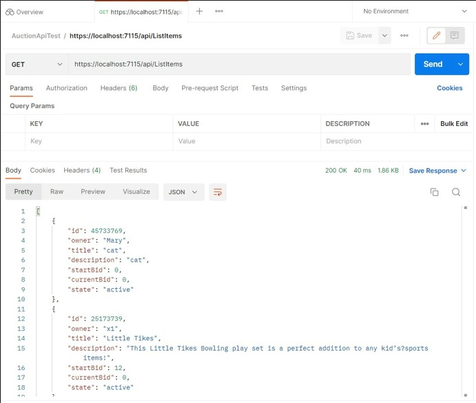

# Features implemented
## Onion structure - clear separation of DB access layer and API layer
Seperate Domain, Service and API layers
## Usage of EF Core
Uses entity framework and connects to a local SQL database
## Usage of caching to speed up calls - uses redis for caching
Uses Redis caching service to fetch User objects more efficiently
## End to end testing using Postman or JMeter
Uses Postman to test the local hosted API
  
## Comprehensive unit testing
uses N-unit testing with NSubstitue and fluent assertions

